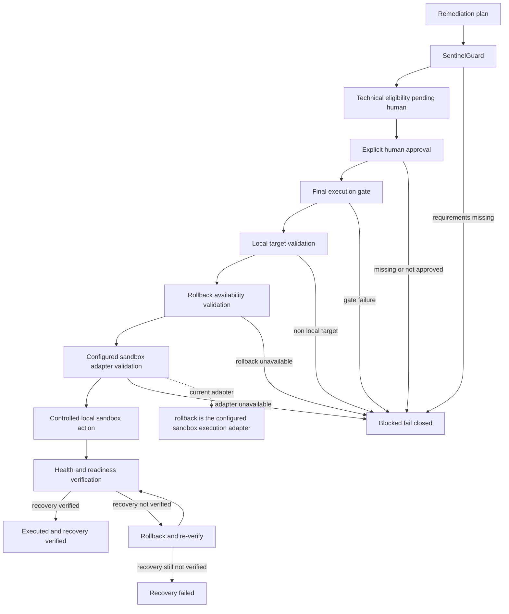

# Execution Lifecycle

## Purpose

This diagram represents the exact local safety path implemented for a remediation request. It is intentionally narrower than the remediation allowlist.

## Explanation

SentinelGuard can make a plan technically eligible, but that does not execute it. A separate human approval record and final gate are required. The runtime validates fail-closed configuration, prior Guard readiness, rollback availability, local target status, an allowlisted action, an implemented adapter, and an identified human approver. It then probes `/live` and `/ready` before and after action.

`rollback` is the only currently configured sandbox execution adapter, mapped to `POST /failure-mode/reset`. `traffic_shift` and `restart` are planning/allowlist concepts only; without sandbox adapters, they block at the final gate.

## Provenance and runtime boundary

- **LOCAL:** Current execution mode is `local_sandbox`.
- **NOT CONNECTED:** No production target can pass the local-target gate.
- **IMPLEMENTED:** Recovery failure triggers the configured rollback path and re-verification attempt.
