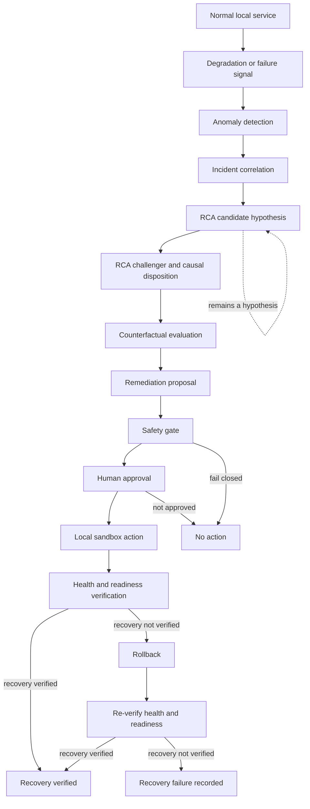

# Failure to Recovery Flow

## Purpose

This scenario-neutral flow shows the implemented engineering path from a local service degradation signal to a verified recovery or a reported recovery failure.

## Explanation

Detection and correlation produce an incident context, followed by an RCA candidate and challenger/causal assessment. The candidate is never shown as a confirmed root cause. Counterfactual evaluation is simulated decision support for a remediation proposal; it cannot command an action.

Only a plan that survives safety controls and explicit human approval may enter local sandbox execution. Runtime health/readiness probes determine whether recovery is verified. If not, the configured rollback path is attempted and health/readiness is rechecked; remaining failure is recorded rather than treated as successful remediation.

## Provenance and runtime boundary

- **LOCAL:** Service, action, rollback, and verification paths refer to the local sandbox environment.
- **SIMULATED:** Counterfactual evaluation does not perform the depicted action.
- **DEVELOPMENT/SYNTHETIC DATA:** The upstream signal path is not evidence of production monitoring performance.
- **NOT CONNECTED:** No production deployment or production recovery claim is implied.
