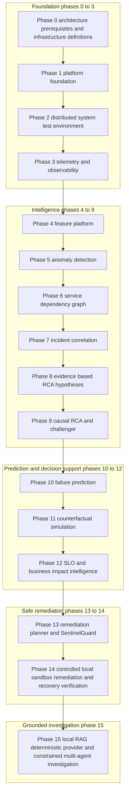

# Phase Architecture

## Purpose

This phase map groups the implemented Phase 0 through Phase 15 responsibilities. It is an implementation/provenance map, not a production deployment diagram.

## Explanation

The first four phases establish the local environment and telemetry foundations. Phases 4–9 turn telemetry artifacts into features, anomalies, graph/incident context, RCA hypotheses, and challenged causal dispositions. Phases 10–12 provide development-data prediction, simulated counterfactual analysis, and priority intelligence. Phases 13–14 constrain planning and local sandbox execution; Phase 15 investigates accumulated evidence without granting agent authority.

## Provenance annotations

| Group | Status |
| --- | --- |
| Phases 0–9 | **IMPLEMENTED** locally; telemetry and associated evaluation artifacts are development-oriented. |
| Phase 10 | **IMPLEMENTED** with **DEVELOPMENT/SYNTHETIC DATA** measurements, not production performance. |
| Phase 11 | **IMPLEMENTED** and **SIMULATED**; no counterfactual execution authority. |
| Phase 14 | **IMPLEMENTED** as **LOCAL** sandbox execution with rollback as the configured adapter. |
| Phase 15 | **IMPLEMENTED** and **DETERMINISTIC** with `DeterministicGroundedProvider`. |
| Entire map | **NOT CONNECTED** to production infrastructure. |
