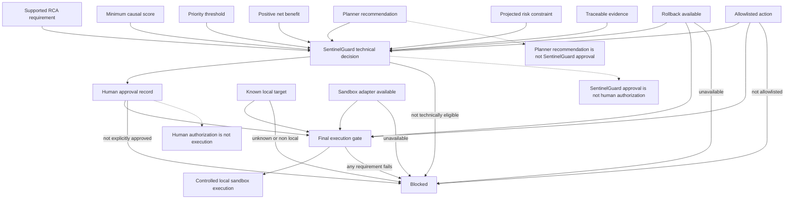

# Remediation Safety Gate

## Purpose

This diagram separates planning, Guard assessment, human authorization, and execution. Each is a distinct state transition.

## Explanation

The planner may recommend an action after its own thresholds. SentinelGuard independently applies its stricter technical decision requirements. Even a technically eligible result is pending explicit human authorization. The final gate then rechecks local targeting, rollback, allowlisting, and configured adapter availability before an action can be attempted.

The repository configures a sandbox adapter only for `rollback`. `traffic_shift` and `restart` can be present in planning and allowlist data, but are blocked because no sandbox adapter is available for them.

## Provenance and runtime boundary

- **LOCAL:** Known targets must be local for execution.
- **NOT CONNECTED:** Production targets are outside the configured execution boundary.
- **IMPLEMENTED:** Guard and final-gate logic are fail-closed.
