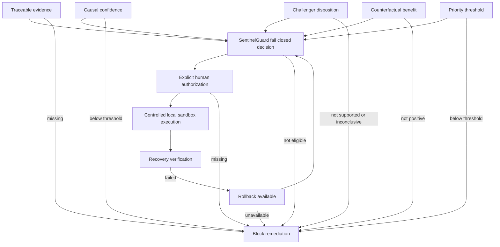

# Safety Control Plane

## Purpose

This control-plane view shows the independent conditions that prevent remediation from progressing when supporting evidence or controls are absent.



## Explanation

The planner consumes technical and decision-support inputs, but only SentinelGuard evaluates the configured safety contract. Guard requirements include evidence, supported RCA, causal score, priority, projected benefit/risk, rollback, and approval prerequisites. Human authorization and final execution-gate checks are separate controls, not fields that an agent or planner can override.

The diagram uses a fail-closed representation: missing inputs lead to a block, and failed recovery routes to rollback rather than a success claim.

## Final rule

```text
NO REMEDIATION WITHOUT
EVIDENCE
+ CONFIDENCE
+ SAFETY
+ AUTHORIZATION
+ ROLLBACK
+ VERIFICATION
```

## Provenance and runtime boundary

- **LOCAL:** The executable path ends at local sandbox execution.
- **SIMULATED:** Counterfactual benefit is a simulation input, not an execution command.
- **NOT CONNECTED:** The safety contract does not integrate with production infrastructure in this repository.
